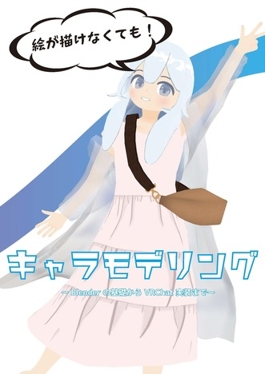

 

# 3DCG

### アバター

最近(2024年時点)の作業は主にこれです。

基本的にデバッグをVRChat上で行っているので、時系列に並べたスクショを置いておきます。



 

また、キャラクターモデリングに関して技術同人誌の執筆も行いました。

[絵が描けなくてもキャラモデリング(2023)](https://bastelcolor.booth.pm/items/5354527)

こちらについて、[技書博9](https://gishohaku.dev/gishohaku9)の『技書博アワード』にて優秀賞を頂きました。

 

### 建物関係



Unityのlightingに慣れるため始めたVRChat用アパートの制作です。まだ途中ですが、ワールドとしてはアップロードしてあります。
[SimpleApartment αver․](https://vrchat.com/home/world/wrld_bbe664a6-5540-45d8-9379-449b560577ac/info)

 

 

# 動画制作

### まとめ動画(2022年3月)


 ちょっとした仕事を貰う過程で作りました。

 

### Youtube

Youtubeにもいくつか動画を出しているのでご紹介。



2D絵を中心とした動画制作に関する解説動画

 



ZETA DIVISIONのMasters Reykjavik(2022)まとめ動画、大会当時世界3位
